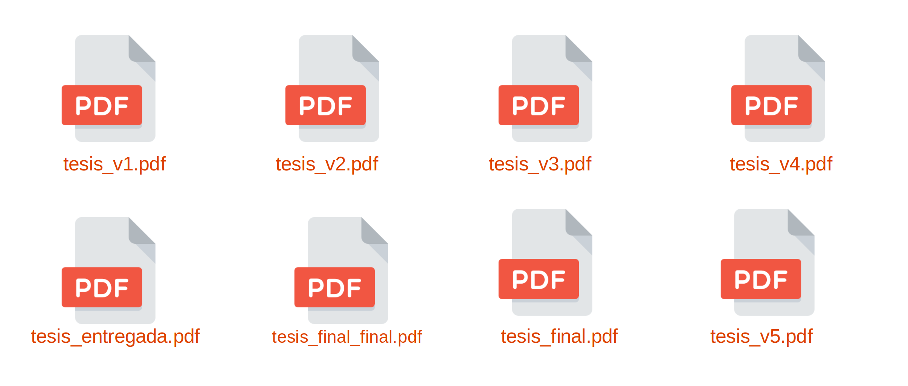
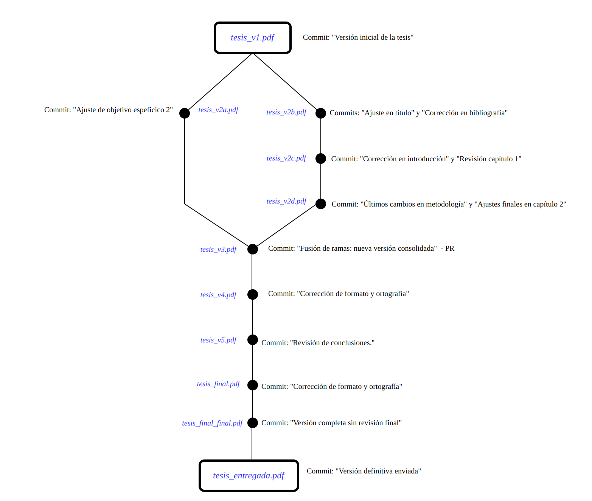

# ***💻Clase 1: Introducción a Git y GitHub💻***





## ⭐ Objetivo
Aprender los conceptos fundamentales del control de versiones con Git y cómo utilizar GitHub para colaboración en equipo.


---

## 📄 Contenido
### 🔍 **1. ¿Qué es Git y por qué es importante?**
Git es un sistema de control de versiones distribuido que permite a los desarrolladores gestionar cambios en el código, colaborar de manera eficiente y mantener un historial de modificaciones.

### 💻 **2. Instalación y Configuración de Git**
#### **👉 Instalación en Linux/Mac**
```bash
sudo apt install git   # Para Debian/Ubuntu
brew install git       # Para MacOS
```
#### **👉 Instalación en Windows***

Descargar e instalar desde: https://git-scm.com/downloads

#### **👉 Configurar Git** (solo la primera vez)

```bash
git config --global user.name "Tu Nombre"  
git config --global user.email "tu-email@example.com"  
```

Verificar la configuración:

```bash
git config --list  
```

---

### **3. Comandos básicos en Git**

| Comando | Descripción |
|---------|-------------|
| git init | Inicializa un nuevo repositorio local. |
| git add . | Agrega archivos al área de preparación. |
| git commit -m "Mensaje" | Guarda los cambios en el historial local. |
| git remote add origin URL | Conecta el repositorio local con GitHub. |
| git push origin main | Envía los cambios al repositorio remoto. |
| git pull origin main | Obtiene los últimos cambios del repositorio remoto. |

---

### 🛠️ **4. Creación y manejo de ramas en GitHub**
Las ramas en Git permiten trabajar en nuevas funcionalidades sin afectar el código principal.

#### **👉 Crear y cambiar de rama**

```bash
git checkout -b nueva-rama
```
#### **👉 Listar ramas**

```bash
git branch
```

#### **👉 Cambiar a otra rama**

```bash
git checkout main
```


#### **👉 Subir una rama a GitHub**

```bash
git push origin nueva-rama
```
 

#### **👉 Fusionar una rama con `main`**

```bash
git checkout main  
git pull origin main  # Traer los cambios más recientes de main
git checkout mi-rama  # Volver a tu rama
git merge main  # Fusionar los cambios más recientes en tu rama
```
 

---

### 🌐 **5. Resolución de conflictos en Git**
Los conflictos ocurren cuando dos personas modifican la misma línea de código.

#### **👉 Pasos para resolver conflictos**

1. Cambiar a la rama `main` y obtener la última versión del repositorio:  
    ```bash
    git checkout main  
    git pull origin main  
    ```

2. Cambiar a la rama de trabajo:  
    ```bash
    git checkout nueva-rama  
    ```

3. Fusionar `main` en la rama actual para asegurarse de que está actualizada:  
    ```bash
    git merge main  
    ```

4. Si hay conflictos, Git los marcará en los archivos afectados.  

5. Editar manualmente los archivos y decidir qué cambios conservar.  

6. Agregar los cambios resueltos con:  
    ```bash
    git add .  
    ```

7. Hacer un nuevo commit con la resolución de conflictos:  
    ```bash
    git commit -m "Conflictos resueltos con main"  
    ```

8. Subir la versión final de la rama a GitHub:  
    ```bash
    git push origin nueva-rama  
    ```

9. **Ir a GitHub y crear un Pull Request** desde `nueva-rama` hacia `main`.  


---

## ***🛠️ Práctica: Trabajo colaborativo con Git y GitHub***

 - **🔄 1. Clonar un repositorio de prueba**

 - **🏠 2. Crear modificar el archivo `README.md` y hacer un commit**

 - **💾 3. Subir los cambios a GitHub**

 - **📝 4. Crear una rama y realizar cambios**

 - **🛠️ 5. Resolver un conflicto de merge**

---

## 🌟 **Conclusión**
Al finalizar esta sesión, los estudiantes habrán aprendido:

✅ Los fundamentos de Git y GitHub.  
✅ Cómo gestionar versiones de código con commits y ramas.  
✅ Cómo trabajar colaborativamente sin sobrescribir cambios.  
✅ Cómo resolver conflictos y fusionar código en equipo.

🚀 **¡Ahora estás listo para gestionar proyectos con Git y GitHub!**
