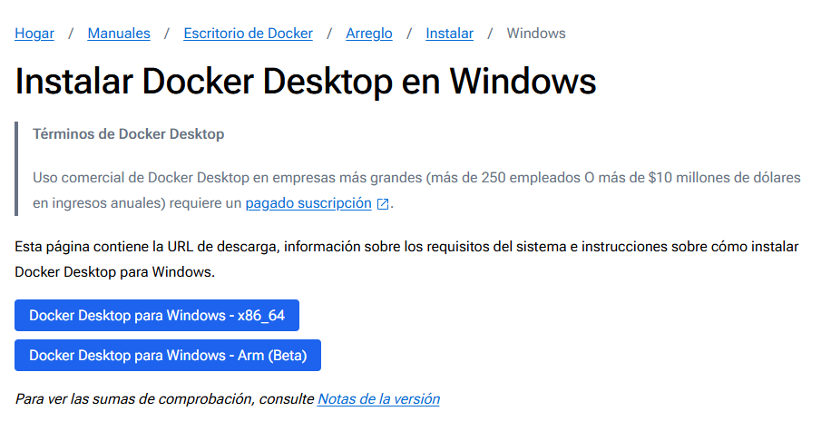
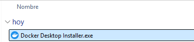
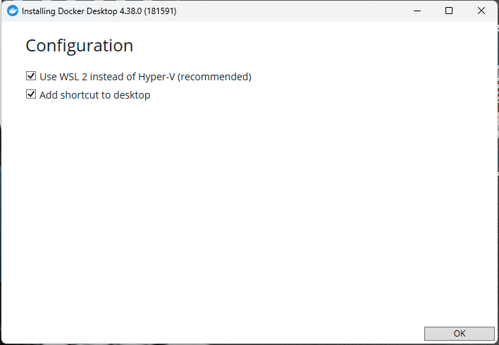
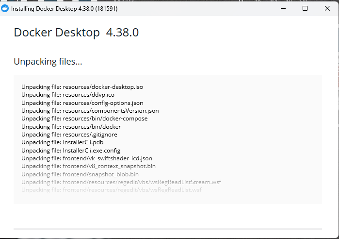
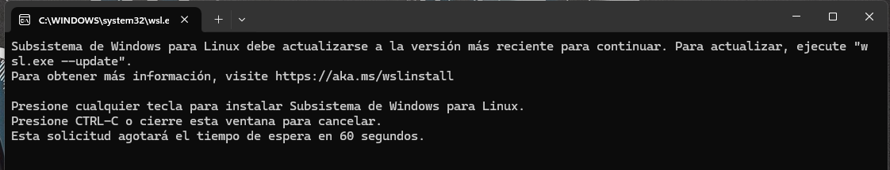
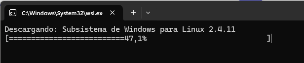
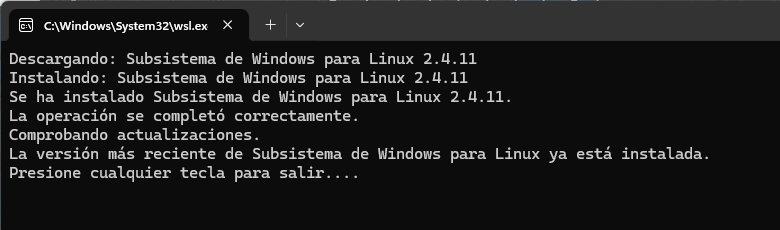
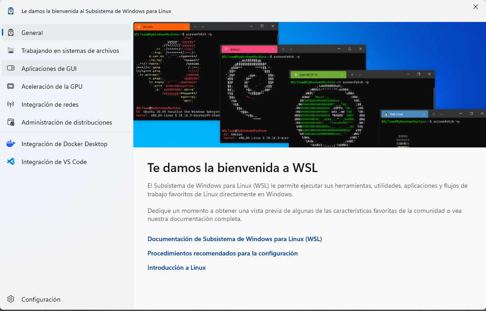

# Instalación de Docker en Windows

Este documento muestra los pasos para instalar Docker Desktop en Windows.

### ***Paso 1: Descargar Docker Desktop***

Accede a la [página oficial de Docker Desktop](https://www.docker.com/products/docker-desktop) y descarga la versión para Windows.

### ***Paso 2: Ejecutar el instalador***

Una vez descargado, ejecuta el archivo de instalación.

### ***Paso 3: Pre-instalación***

Revisa la comprobación previa a la instalación:

### ***Paso 4: Proceso de instalación.***

Si todo está funcionando bien deberías ver algo de este estilo:

### ***Paso 5: Configurar WSL***

Sugerencia dada por Windowns:

1. Verifica la sugerencias de tu sistema:

   

2. Instalando...

   

3. Instalado!

   

4. Lo que ahora tienen en tu sistema Windows:

   

### ***Paso 6: Pasos Post-instalación***

Una vez integrado, dispara docker-desktop, puedes realizar algunos ajustes post-instalación para optimizar el uso de Docker:

1. Ajuste inicial post-instalación

   

2. Sugerencias de selección:

   

   

### ***Paso 7: Inicio de Docker Desktop***

¡Felicidades! Ahora puedes abrir Docker Desktop desde el menú de inicio o el acceso directo en tu escritorio. La aplicación debería iniciarse correctamente y estar lista para usar. Podrás verificar que está funcionando correctamente viendo el icono de Docker en la barra de tareas.